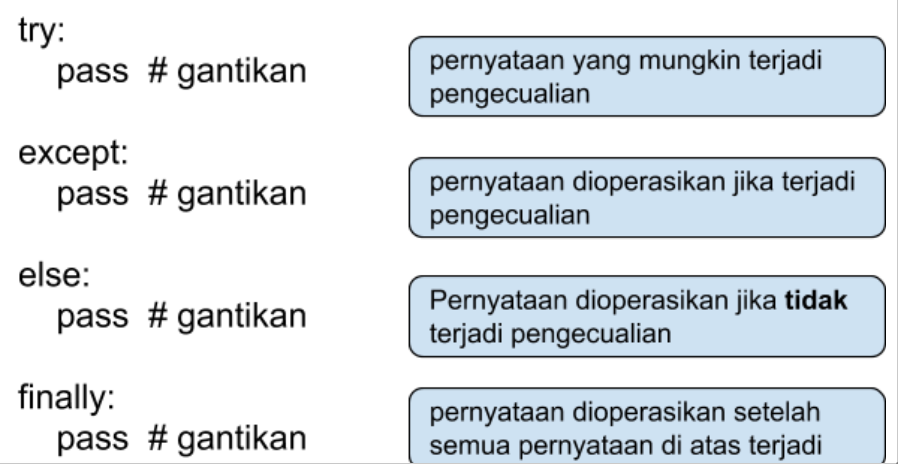

# Penanganan Kesalahan (Error dan Exception Handling)

Ada setidaknya dua jenis kesalahan berdasarkan kejadiannya: 

1. Kesalahan sintaksis (syntax errors) atau sering disebut kesalahan penguraian (parsing errors).
2. Pengecualian (exceptions) atau sering disebut kesalahan saat beroperasi (runtime errors).

Kesalahan sintaksis terjadi ketika Python tidak dapat mengerti apa yang Anda perintahkan. Sedangkan pengecualian (kesalahan saat beroperasi) terjadi ketika Python mengerti apa yang Anda perintahkan tetapi mendapatkan masalah saat mengikuti yang Anda perintahkan (terjadi saat aplikasi sudah mulai beroperasi).

## Kesalahan Sintaksis

Kesalahan sintaksis biasanya sering terjadi saat Anda masih baru memulai belajar Python, misalnya contoh berikut adalah penempatan indentasi (spasi di awal) yang tidak sesuai.

~~~
print('salah indentasi')
 File "<stdin>", line 1
   print('salah indentasi')
   ^
IndentationError: unexpected indent
~~~

Contoh berikut ini menampilkan kesalahan sintaksis, dimana setelah kondisi dari perintah while diharuskan ada tanda titik dua (:).

~~~
while True print('Hello world')
 File "<stdin>", line 1
   while True print('Hello world')
                  ^
SyntaxError: invalid syntax
~~~

Pada kesalahan sintaksis, baris dimana kesalahan terdeteksi dimunculkan kembali, kemudian terdapat tanda panah yang menunjukkan titik paling awal dari kesalahan.

Kedua contoh di atas memiliki kelompok (tipe) kesalahan yang berbeda, yang pertama adalah IndentationError dan yang kedua adalah SyntaxError. Kemudian setelah penyebutannya, ada pesan detail kesalahan (keterangan), misalnya indentasi yang tidak diharapkan (unexpected).

Jika Anda menggunakan mode pemanggilan skrip, nama file skrip dan nomor baris dimana terjadi kesalahan akan dimunculkan. Sedangkan untuk mode interaktif pada dua contoh di atas, nama file muncul sebagai “<stdin>”. Berikut adalah contoh pada pemanggilan skrip bernama contoh_salah_sintaksis.py dimana terjadi kesalahan pada baris 2.

~~~
python contoh_salah_sintaksis.py  
 File "contoh_salah_sintaksis.py", line 2
   if True print('salah sintaksis')
               ^
SyntaxError: invalid syntax
~~~

## Pengecualian

Meski pernyataan atau ekspresi dari Python sudah Anda tulis dengan benar, ada kemungkinan terjadi kesalahan ketika perintah tersebut dieksekusi. Kesalahan yang terjadi saat proses sedang berlangsung disebut pengecualian (exceptions) dan akan berakibat fatal jika tidak ditangani. Kebanyakan pengecualian di Python tidak ditangani oleh aplikasi, sehingga aplikasi terhenti kemudian muncul pesan kesalahan seperti contoh berikut.

~~~
print(angka)
Traceback (most recent call last):
 File "<stdin>", line 1, in <module>
NameError: name 'angka' is not defined
~~~

Misalkan Anda lupa memberikan nilai pada variabel angka, tetapi Anda langsung memanggil variabel tersebut. Secara sintaksis sudah sesuai, tapi muncul pengecualian dengan kelompok (tipe) kesalahan **NameError** dan pesan detail kesalahan yang menyatakan bahwa variabel angka tidak terdefinisi.

Contoh lain terkait pengecualian yang sering juga terjadi adalah operasi dari variabel yang jenisnya tidak sesuai, misalnya contoh berikut.

~~~
bukan_angka = '1'
bukan_angka + 2
Traceback (most recent call last):
 File "<stdin>", line 1, in <module>
TypeError: can only concatenate str (not "int") to str
~~~

Pada contoh tersebut, variabel bukan_angka berjenis string, sehingga saat mengoperasikan variabel tersebut dengan angka (berjenis integer), meskipun secara sintaksis sudah sesuai, muncul pengecualian dengan kelompok (tipe) kesalahan **TypeError** dan pesan detail kesalahan yang menyatakan bahwa operasi penambahan untuk string (contatetation) hanya bisa dilakukan jika kedua operannya adalah string (dan bukan integer).

Seperti terlihat bahwa pada saat terjadi pengecualian, informasi yang muncul seperti saat terjadi kesalahan (errors), termasuk juga informasi nama file dan nomor baris dimana kesalahan terjadi.

[Python Exception Documentation](https://docs.python.org/id/3.8/library/exceptions.html)

## Penanganan Pengecualian

Pada aplikasi Python yang Anda buat bisa dilengkapi dengan penanganan terhadap pengecualian (exceptions handling) dari kelompok (tipe) kesalahan yang Anda tentukan. Proses penanganan pengecualian menggunakan pernyataan try yang berpasangan dengan except.

Misalnya kita ingin menangani pengecualian yang terjadi jika ada pembagian angka dengan nilai nol (0).

~~~
>>> z = 0
>>> 1 / z
 
Traceback (most recent call last):
File "<stdin>", line 1, in <module>
ZeroDivisionError: division by zero
 
>>> try:
...     x = 1 / z
...     print(x)
... except ZeroDivisionError:
...     print('tidak bisa membagi angka dengan nilai nol')
 
tidak bisa membagi angka dengan nilai nol
~~~

Perhatikan bahwa operasi aplikasi berhenti di x = 1 / z, sedangkan bagian print(x) tidak sempat dioperasikan, karena aplikasi sudah mengalami pengecualian, sehingga yang tercetak adalah operasi print(‘tidak bisa membagi angka dengan nilai nol’).

Pada operasi yang dicontohkan di atas, penanganan pengecualian untuk **ZeroDivisionError** dilakukan sehingga aplikasi tidak lagi keluar dari eksekusi karena kesalahan, tapi digantikan dengan mencetak pesan ke layar. Pada contoh ini kita fokus pada penanganan pengecualian, meskipun ada cara lain untuk menyelesaikannya, misal menggunakan kondisi (percabangan) untuk menghindari nilai nol.

Pernyataan except dilanjutkan dengan kelompok (tipe) kesalahan yang ingin ditangani, atau bisa juga berupa tuple dari satu atau lebih tipe kesalahan yang akan ditangani. Di contoh berikut, menangani **FileNotFoundError** sebagai tuple satu elemen, jangan lupa dalam menuliskan tuple satu elemen harus tetap diakhiri dengan koma.

~~~
>>> try:
...     with open('contoh_tidak_ada.py') as file:                   
...         print(file.read())                          
... except (FileNotFoundError, ):
...     print('file tidak ditemukan')
...  
file tidak ditemukan
~~~

Pada operasi di atas, aplikasi akan membuka dan mengakses file bernama contoh_tidak_ada.py, tetapi file tersebut tidak ada di direktori dimana aplikasi Python tersebut berada, selanjutnya akan terjadi pengecualian (exceptions) tetapi ditangani, dalam pasangan pernyataan try dan except, sehingga aplikasi tidak terhenti tetapi tercetak di layar bahwa file tidak ditemukan.

Dalam aplikasi yang lebih kompleks, penanganan pengecualian dapat menggunakan pernyataan except lebih dari satu. Di contoh berikutnya akan menggunakan pernyataan except lebih dari satu (untuk satu pernyataan try), maupun menggunakan satu pernyataan except yang menangani lebih dari satu tipe kesalahan yang digabung dalam sebuah tuple.

~~~
>>> d = {'ratarata': '10.0'}
>>> try:
...     print('rata-rata: {}'.format(d['rata_rata']))
... except KeyError:                                 
...     print('kunci tidak ditemukan di dictionary')
... except ValueError:              
...     print('nilai tidak sesuai')
...  
kunci tidak ditemukan di dictionary
>>> try:
...     print('rata-rata: {}'.format(d['ratarata']/3))
... except KeyError:                                 
...     print('kunci tidak ditemukan di dictionary')
... except (ValueError, TypeError):
...     print('nilai atau tipe tidak sesuai')
...  
nilai atau tipe tidak sesuai
>>> try:
...     print('pembulatan rata-rata: {}'.format(int(d['ratarata'])))
... except (ValueError, TypeError) as e:         
...     print('penangan kesalahan: {}'.format(e))
...  
penangan kesalahan: invalid literal for int() with base 10: '10.0'
~~~

Pada contoh tersebut, yang paling awal terjadi pengecualian untuk tipe kesalahan KeyError karena dalam dictionary d tidak memiliki kunci (key) rata_rata, yang ada adalah kunci ratarata.

Kemudian contoh selanjutnya terjadi pengecualian untuk tipe kesalahan TypeError karena nilai d[‘ratarata’] memiliki tipe string, sehingga tidak dapat dibagi dengan integer (angka) 3. Dalam penanganan kesalahannya, satu buah pernyataan except menangani tipe kesalahan ValueError atau TypeError, sehingga cocok salah satunya akan menampilkan ke layar bahwa nilai atau tipe tidak sesuai.

Di bagian paling akhir contoh, terjadi pengecualian untuk tipe kesalahan ValueError karena berusaha melakukan konversi (casting) dari sebuah string ke integer dengan format yang tidak sesuai (bilangan bulat seharusnya tidak memiliki titik dalam penulisannya). Dalam penulisan penanganan kesalahannya digunakan variasi lain untuk mendapatkan pesan kesalahan sebagai variabel e untuk kemudian variabel tersebut dicetak dalam pesan yang ditampilkan ke layar.

Bentuk lengkap dari pernyataan try dapat dilihat pada bagan berikut, terdiri dari pernyataan except, else, finally.

## Menghasilkan Pengecualian

Dalam membuat aplikasi, ada kemungkinan Anda butuh untuk menghasilkan pengecualian (raise exceptions), salah satu caranya bisa dengan menggunakan pengecualian yang sudah ada, hanya ditambahkan informasi detailnya saja.

Misalnya dalam contoh berikut, Anda mewajibkan sebuah dictionary memiliki kunci (key) total.

~~~
>>> d = {'ratarata': '10.0'}
>>> if 'total' not in d:                                                                                                                         
...     raise KeyError('harus memiliki total')                                                                           
...                                                                                                                                              
Traceback (most recent call last):                                                                                                               
 File "<stdin>", line 2, in <module>                                                                                                            
KeyError: 'harus memiliki total'
~~~