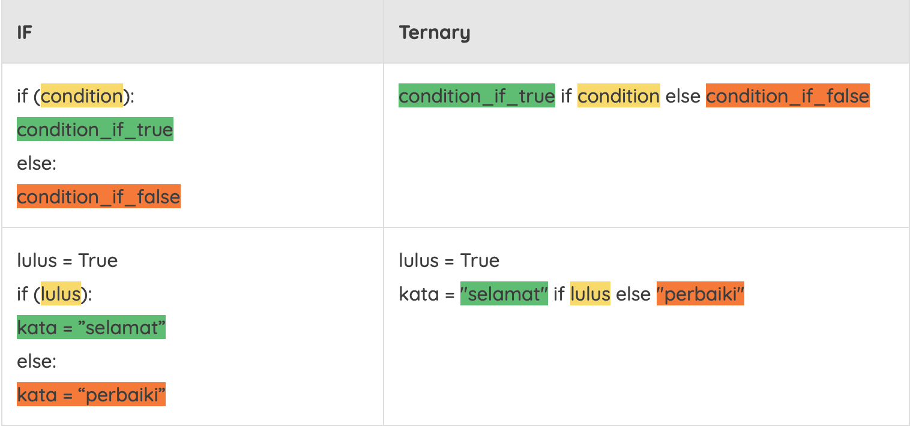
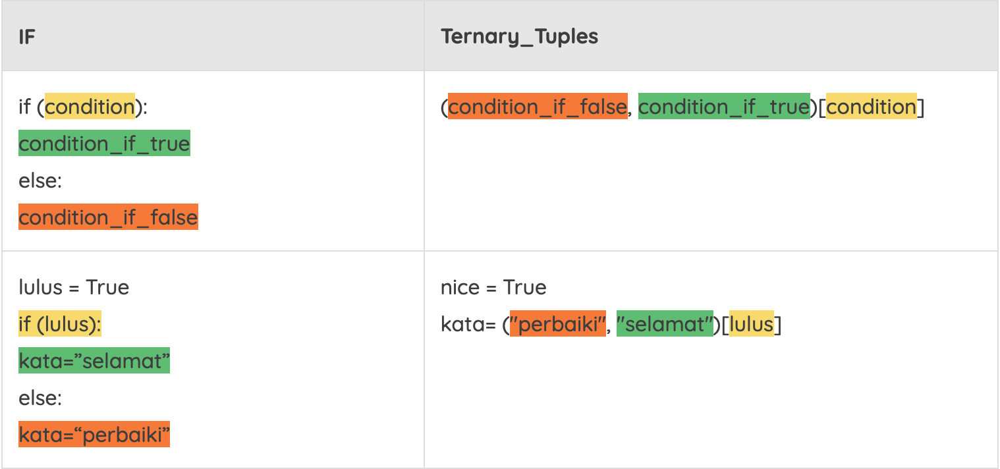

# FLow Control

## if-else

~~~
tinggi_badan = int(input("Masukkan tinggi badan Anda : "))
if tinggi_badan>=160:
   print ("Silakan, Anda boleh masuk")
else:
   print ("Maaf, Anda belum boleh masuk")
~~~

Output:

~~~
Masukkan tinggi badan Anda : 160
Silakan, Anda boleh masuk
~~~

# elif 

~~~
nilai = int(input("Masukkan nilai tugas Anda : "))
if nilai>80:
   print("Selamat! Anda mendapat nilai A")
   print("Pertahankan!")
elif nilai>70:
   print("Hore! Anda mendapat nilai B")
   print("Tingkatkan!")
elif nilai>60:
   print("Hmm.. Anda mendapat nilai C")
   print("Ayo semangat!")
else:
   print("Waduh, Anda mendapat nilai D")
   print("Yuk belajar lebih giat lagi!")
~~~

Output:

~~~
Masukkan nilai tugas Anda : 85
Selamat! Anda mendapat nilai A
Pertahankan!
~~~

## Ternary Operators

Ternary operator lebih dikenal sebagai conditional expressions pada Python. Operator menentukan sesuatu berdasarkan kondisi True atau False. Jika statement atau klausa if Anda cukup sederhana, maka ternary Operators akan sangat membantu.

Perbandingan klausa IF dengan ternary Operators:

Opsi lain dari ternary operators melibatkan tuples. Contoh kodenya berikut:

Pada tuple ini, dimanfaatkan nilai [0] sebagai False dan [1] sebagai True.

Aplikasi kedua ini menurut beberapa aktivis kurang ‘pythonic’, salah satunya karena cukup membingungkan untuk meletakkan klausa saat True atau False. Selain itu, kedua nilai akan tetap dievaluasi walaupun hanya dibutuhkan salah satunya. Lihat contoh berikut:

~~~
kondisi = True
print(2 if kondisi else 1/0)
#Output is 2
 
print((1/0, 2)[kondisi])
#Eror Pembagian Nol akan muncul
~~~

Ternary-tuples sebaiknya dihindari, terutama untuk kode (dan klausa True/False) yang kompleks. Ternary dapat digunakan untuk menyingkat kode saat klausa True/False Anda cukup pendek - misalnya sebuah fungsi tanpa parameter.

## ShortHand Ternary

Selain Ternary Operators, dikenal juga shorthand ternary tag yang mungkin membantu Anda untuk memeriksa kode/hasil dari sebuah fungsi dan memastikan outputnya tidak menyebabkan error (atau minimal memberikan informasi relevan saat error):

~~~
hasil = None
pesan = hasil or "Tidak ada data"
print(pesan)
~~~

Output:

~~~
Tidak ada data
~~~

## for

~~~
for huruf in 'Dicoding':  # Contoh pertama
    print('Huruf: {}'.format(huruf))
 
flowers = ['mawar', 'melati', 'anggrek']
for flower in flowers:  # Contoh kedua
    print('Flower: {}'.format(flower))
~~~

Output:

~~~
Huruf : D
Huruf : i
Huruf : c
Huruf : o
Huruf : d
Huruf : i
Huruf : n
Huruf : g
Flower: mawar
Flower: melati
Flower: anggrek
~~~

~~~
flowers = ['mawar', 'melati', 'anggrek']
for index in range(len(flowers)):
    print('Flowers: {}'.format(flowers[index]))
~~~

Output:

~~~
Flower : mawar
Flower : melati
Flower  : anggrek
~~~

## While

While pada bahasa Python digunakan untuk mengeksekusi statement selama kondisi yang diberikan terpenuhi (True). Kondisi dapat berupa expression apapun, dan harap diingat bahwa True di Python termasuk semua nilai non-zero. Saat kondisi menjadi False, program akan melanjutkan ke baris setelah blok statement.

~~~
count = 0
while (count < 7):
    print('Hitungannya adalah: {}'.format(count))
    count = count + 1
~~~

Output:

~~~
Hitungannya adalah: 0
Hitungannya adalah: 1
Hitungannya adalah: 2
Hitungannya adalah: 3
Hitungannya adalah: 4
Hitungannya adalah: 5
Hitungannya adalah: 6
~~~

## Break

Pernyataan break menghentikan perulangan kemudian keluar, dilanjutkan dengan mengeksekusi pernyataan (statement) setelah blok perulangan. Salah satu penggunaannya yang paling sering adalah sebuah kondisi eksternal yang membutuhkan program untuk keluar dari perulangan. Jika Anda memiliki perulangan bertingkat, break akan menghentikan perulangan sesuai dengan tingkatan atau di perulangan mana ia berada. Namun jika ia diletakkan di perulangan dengan kedalaman kedua misalnya, hanya perulangan itu saja yang berhenti, tidak dengan perulangan utama.

~~~
for huruf in 'Dico ding':
    if huruf == ' ':
        break
    print('Huruf saat ini: {}'.format(huruf))
~~~

Output:

~~~
Huruf saat ini: D
Huruf saat ini: i
Huruf saat ini: c
Huruf saat ini: o
~~~

~~~
for i in range (0,10):
    for j in range (0,10):
        if j>i:
            print()
            break
        else:
            print("*",end="")
~~~

Output:

~~~
*
**
***
****
*****
******
*******
********
*********
**********
~~~

## Continue

Pernyataan continue akan membuat iterasi saat ini berhenti, kemudian melanjutkan ke iterasi berikutnya, mengabaikan pernyataan (statement) yang berada antara continue hingga akhir blok perulangan.

~~~
for huruf in 'Dico ding':
    if huruf == ' ':
        continue
    print('Huruf saat ini: {}'.format(huruf))
~~~

Output:

~~~
Huruf saat ini: D
Huruf saat ini: i
Huruf saat ini: c
Huruf saat ini: o
Huruf saat ini: d ## perhatikan spasi dilewati
Huruf saat ini: i
Huruf saat ini: n
Huruf saat ini: g
~~~

## else setelah for

Pada Python juga dikenal fungsi else setelah for. Fungsinya diutamakan pada perulangan yang bersifat pencarian - untuk memberikan jalan keluar program saat pencarian tidak ditemukan.

Struktur umumnya adalah sebagai berikut:

~~~
for item in items:
    if cari(item):
        #ditemukan!
        proses_item()
        break
else:
    #Item tidak ditemukan
    not_found_in_container()
~~~

## else setelah while

Berbeda dengan Else setelah For, pada statement while, blok statement else akan selalu dieksekusi saat kondisi pada while menjadi salah. Contoh mudahnya adalah sebagai berikut:

~~~
n = 10
while n > 0:
    n = n - 1
    if n == 7:
        break
    print(n)
else:
    print("Loop selesai")
~~~

Output:

~~~
9
8
~~~

Pada contoh diatas, loop akan di break saat nilai n == 7, saat keluar dari perulangan, maka python tidak akan memunculkan tulisan Loop selesai, namun jika tidak dilakukan break (perulangan berakhir dengan normal):

~~~
n = 10
while n > 0:
    n = n - 1
    print(n)
else:
    print("Loop selesai")
~~~

Output:

~~~
9
8
7
6
5
4
3
2
1
0
Loop selesai
~~~

## Pass

Digunakan jika Anda menginginkan sebuah pernyataan atau blok pernyataan (statement), namun tidak melakukan apapun - melanjutkan eksekusi sesuai dengan urutannya. Kontrol ini banyak digunakan saat Anda belum melakukan implementasi (atau menyiapkan tempat untuk implementasi), serta membiarkan program tetap berjalan saat misalnya Anda mengalami kegagalan atau exception.

Pass statement adalah operasi bersifat Null (kosong), tidak ada yang terjadi saat ia dipanggil. Contohnya:

~~~
def sebuahfungsi():
    pass
~~~

Output:

~~~
#tidak ada
~~~

## List Comprehension (membuat list dengan inline loop dan if)

~~~
angka = [1, 2, 3, 4]
pangkat = [n**2 for n in angka]
print(pangkat)
~~~

Output:

~~~
[1, 4, 9, 16]
~~~

~~~
list1 = ['d', 'i', 'c', 'o']
list2 = ['d', 'i', 'n', 'g']
duplikat = []
for a in list1:
  for b in list2:
    if a == b:
      duplikat.append(a)
     
print(duplikat)  # Output ['d','i']
~~~

Hasilnya akan sama dengan:

~~~
list1 = ['d', 'i', 'c', 'o']
list2 = ['d', 'i', 'n', 'g']
duplikat = [a for a in list1 for b in list2 if a == b]
print(duplikat) # Output: ['d','i']
~~~

~~~
list_a = ["Hello", "World", "In", "Python"]
small_list_a = [_.lower() for _ in list_a]
print(small_list_a)
~~~

Output:

~~~
['hello', 'world', 'in', 'python']
~~~

Anda tidak perlu bingung saat melihat kode di Internet yang menuliskan seperti contoh di atas, karena garis bawah (underscore) termasuk penamaan variabel yang valid. Secara umum "_" biasa digunakan sebagai throwaway variable (variabel tidak penting). 