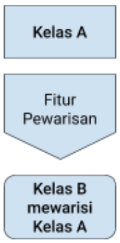

# Object Oriented Programming

## Class

Class merupakan sintaksis di Python yang menyediakan semua fitur-fitur standar dari Pemrograman Berorientasi Objek atau dalam bahasa Inggris disebut dengan Object Oriented Programming (OOP).

Definisi dari kelas menggunakan sintaksis class seperti hanya definisi fungsi yang menggunakan sintaksis def, kemudian perlu dipanggil (dieksekusi) dahulu sebelum dapat digunakan dan memiliki efek pada program.

~~~
class NamaKelas:
    pass  # gantikan dengan pernyataan-pernyataan, misal: atribut atau metode
~~~

Pada pemanggilan sintaksis class tersebut, setelah seluruh pernyataan-pernyataan semuanya selesai diproses (didaftarkan sebagai atribut ataupun metode), maka kelas sudah dibuat dan dapat digunakan.

## Class Constructor

Pada proses instantiation dari class, sering ditemui kebutuhan mengeset nilai awal atau kondisi awal dari atribut yang dimiliki oleh class tersebut, sehingga untuk kebutuhan ini digunakan sebuah fungsi khusus yang biasa disebut sebagai pembangun atau dalam bahasa Inggris disebut constructor. Di Python, fungsi khusus atau metode sebagai constructor ini bernama __init__ atau biasa diucapkan sebagai "double underscore init". Pada saat dilakukan instantiation dari class, metode __init__ ini secara otomatis akan dipanggil di terlebih dahulu.

~~~
class Kalkulator:
    """contoh kelas kalkulator sederhana"""
 
    def __init__(self):
        self.i = 12345
 
    def f(self):
        return 'hello world'
~~~

Nilai dari atribut i tidak terdefinisi pada awal definisi Kalkulator, setelah dilakukan instantiation maka nilai atribut i akan bernilai 12345. Meskipun bisa mendefinisikan variabel i sebagai atribut dari class Kalkulator, tetapi sebaiknya berhati-hati mengenai variabel yang akan terbagi (shared) untuk semua instance dari class, terutama untuk tipe yang dapat berubah (mutable), misalnya list dan dictionary.

referensi: https://docs.python.org/id/3.8/tutorial/classes.html#class-and-instance-variables

~~~
k = Kalkulator()  # membuat instance dari kelas jadi objek, kemudian disimpan pada variabel k
~~~

Lebih lanjut tentang constructor, tentu saja untuk mendukung aplikasi yang lebih dinamis maka constructor dapat memiliki parameter yang bisa dikirimkan saat proses instantiation, bahkan parameternya bisa lebih dari satu jika diperlukan.

Pada contoh berikut ini, constructor memiliki parameter i yang bersifat opsional, apabila dalam proses instantiation tidak dikirimkan parameter, secara otomatis i akan diisi nilai bawaan 12345.

~~~
class Kalkulator:
    """contoh kelas kalkulator sederhana"""
 
    def __init__(self, i=12345):
        self.i = i  # i adalah variabel pada constructor, self.i adalah variabel dari class
 
    def f(self):
        return 'hello world'
~~~

Dengan contoh pemanggilan berikut.

~~~
k = Kalkulator(i=1024)  # melakukan instantiation sekaligus mengisi atribut i jadi 1024
print(k.i)              # mencetak atribut i dari objek k dengan keluaran nilai 1024
~~~

## Metode (Method)

Terdapat 3 jenis metode:

1. Metode dari objek (object method)
2. Metode dari class (class method)
3. Metode secara static (static method)

### Object Method

Secara umum metode adalah sebuah fungsi khusus yang menjadi “milik” suatu objek, yakni hasil instantiation dari class.

Salah satu hal khusus yang dimiliki oleh metode dengan adanya argumen bernama self. Argumen pertama dari metode-metode dalam class, biasa diberikan nama self sebagai suatu konvensi atau standar penamaan, meskipun Anda bisa juga menggunakan nama lain. Bahkan dalam Python tidak ada arti khusus tentang sintaksis self ini, namun sangat disarankan menggunakan konversi ini agar program Python yang Anda buat akan lebih mudah dimengerti oleh pemrogram lainnya. 

Sebuah metode, sebetulnya dikirimkan objek (hasil instance dari class) sebagai argumen pertamanya, dalam hal ini bernama self.

Misal jika k adalah objek hasil instance dari class Kalkulator, saat melakukan pemanggilan metode f.

~~~
k.f()
~~~

ekuivalen dengan

~~~
Kalkulator.f(k)
~~~

Argumen self pada metode f akan diisi dengan objek hasil instance dari class Kalkulator.

### Classmethod 

Classmethod adalah sebuah fungsi yang mengubah metode menjadi metode dari class (class method). Dalam penggunaannya, fungsi ini dijadikan sebagai fungsi decorator @classmethod, kemudian pemanggilannya bisa langsung dari class yang terdefinisi ataupun melalui objek.

Metode dari class (class method) menerima masukan class secara implisit sebagai argumen pertama yang secara konvensi diberikan nama cls.

Berdasar contoh yang sama dengan class sebelumnya, berikut adalah metode dari class.

~~~
class Kalkulator:
    """contoh kelas kalkulator sederhana"""
 
    def f(self):
        return 'hello world'
 
    @classmethod
    def tambah_angka(cls, angka1, angka2):
        return '{} + {} = {}'.format(angka1, angka2, angka1 + angka2)
~~~

Nampak pada kode, sesuai konvensi ada metode yang menggunakan argumen pertama self, sedangkan untuk class method menggunakan konvensi argumen pertama cls. 

Untuk melakukan pemanggilan dari class, dilakukan seperti berikut, dimana argumen pertama cls sudah mendapatkan masukan class Kalkulator.

~~~
Kalkulator.tambah_angka(1, 2)  # tanpa perlu memberikan masukan untuk argumen cls
~~~

Metode dari class (class method) juga dapat dipanggil dari objek, hasil instantiation dari class Kalkulator, contohnya mirip seperti pemanggilan metode dari objek (object method).

~~~
k = Kalkulator()
print(k.tambah_angka(1, 2))
~~~

### Staticmethod

Staticmethod adalah sebuah fungsi yang mengubah metode menjadi metode statis (static method). Dalam penggunaannya, fungsi ini dijadikan sebagai fungsi decorator @staticmethod, kemudian pemanggilannya bisa langsung dari class yang terdefinisi ataupun melalui objek.
Metode statis (static method) tidak menerima masukan argumen pertama secara implisit.

Untuk Anda yang pernah memrogram Java atau C++, metode statis ini mirip seperti yang ada di bahasa pemrograman tersebut.

Berdasar contoh yang sama dengan class sebelumnya, berikut adalah metode statis.

~~~
class Kalkulator:
    """contoh kelas kalkulator sederhana"""
 
    def f(self):
        return 'hello world'
 
    @staticmethod
    def kali_angka(angka1, angka2):
        return '{} x {} = {}'.format(angka1, angka2, angka1 * angka2)
~~~

Nampak pada kode, tidak ada argumen pertama yang implisit seperti halnya pada dua metode sebelumnya.

Pemanggilan dari class seperti halnya pemanggilan fungsi biasa.

~~~
a = Kalkulator.kali_angka(2, 3)
print(a)
~~~

Metode statis (static method) juga dapat dipanggil dari objek, hasil instantiation dari class Kalkulator, mirip seperti pemanggilan fungsi biasa meskipun dipanggil dari objek.

~~~
k = Kalkulator()
a = k.kali_angka(2, 3)
print(a)
~~~

>NOTE
>>fungsi decorator adalah sebuah fungsi yang mengembalikan fungsi lain, biasanya digunakan sebagai fungsi transformasi dengan "pembungkus" sintaksis @wrapper.
>>
>>Referensi: https://docs.python.org/id/3.8/glossary.html#term-decorator.

[Dokumentasi classmethod](https://docs.python.org/id/3.8/library/functions.html#classmethod)

[Dokumentasi staticmethod](https://docs.python.org/id/3.8/library/functions.html#staticmethod)

## Mekanisme Pewarisan (Inheritance)

Paradigma Pemrograman Berorientasi Objek memiliki konsep pewarisan atau dalam bahasa Inggris disebut inheritance, tentunya di Python mendukung fitur ini.

Suatu kelas B dapat mewarisi kelas A, sehingga secara otomatis memiliki semua fitur yang dimiliki oleh kelas A, dalam hal ini atribut-atribut dan metode-metode.

Dalam contoh ini, kelas A disebut sebagai kelas dasar, yakni kelas yang memberikan warisan atau biasa juga disebut kelas yang diturunkan.

Kemudian kelas B disebut sebagai kelas turunan, yakni kelas yang mendapatkan warisan.
Jika di kelas B memiliki metode dengan nama yang sama dengan yang dimiliki kelas A, maka metode tersebut akan menimpa metode yang diwariskan dari kelas A.

 

>NOTE
>>Frasa kelas dasar adalah terjemahan bahasa Inggris dari frasa base class.
Frasa kelas turunan adalah terjemahan bahasa Inggris dari frasa derived class.
Frasa menimpa metode adalah terjemahan bahasa Inggris dari frasa method override.
Di Python, mekanisme pewarisan memungkinkan untuk memiliki lebih dari satu kelas dasar (kelas orang tua, yang diwarisi).
>>
>>Referensi: https://docs.python.org/id/3.8/tutorial/classes.html#multiple-inheritance

Kita akan mengembangkan aplikasi yang sudah dimiliki di atas, class Kalkulator sebagai kelas dasar yang mempunyai fungsi melakukan penambahan melalui metode tambah_angka.

~~~
class Kalkulator:
    """contoh kelas kalkulator sederhana. anggap kelas ini tidak boleh diubah!"""
 
    def __init__(self, nilai=0):
        self.nilai = nilai
 
    def tambah_angka(self, angka1, angka2):
        self.nilai = angka1 + angka2
        if self.nilai > 9:  # kalkulator sederhana hanya memroses sampai 9
            print('kalkulator sederhana melebihi batas angka: {}'.format(self.nilai))
        return self.nilai
~~~

Kemudian kita punya kebutuhan membuat sebuah kelas yang punya fitur perkalian tapi juga punya fitur penambahan, dalam contoh ini misalnya kita tidak boleh mengubah kalkulator yang sudah ada. Dibandingkan dengan membuat kelas baru kemudian menuliskan kembali implementasi penambahan angka, maka mewarisi kelas yang sudah ada akan lebih efisien.

Dari situ, kita membuat class KalkulatorKali yang mewarisi class Kalkulator.

~~~
class KalkulatorKali(Kalkulator):
    """contoh mewarisi kelas kalkulator sederhana"""
 
    def kali_angka(self, angka1, angka2):
        self.nilai = angka1 * angka2
        return self.nilai
~~~

Dengan pemanggilan class KalkulatorKali sebagai berikut.

~~~
kk = KalkulatorKali()
a = kk.kali_angka(2, 3)  # sesuai dengan definisi class memiliki fitur kali_angka
print(a)
 
b = kk.tambah_angka(5, 6)  # memiliki fitur tambah_angka karena mewarisi dari Kalkulator
print(b)
~~~

Dengan melakukan pewarisan, Anda dengan mudah bisa menambahkan (extend) kemampuan dari suatu class dengan fitur yang ingin Anda buat sendiri. Hal tersebut akan sangat berguna jika Anda ingin membuat aplikasi yang mudah diguna-ulang (reusable).

### Overriding

Anda melihat bahwa kalkulator yang anda operasikan mendapatkan peringatan melebihi batas angka yang bisa diproses? Lalu bagaimana kalau Anda ingin mengubah keterbatasan itu? Meski dalam contoh ini anggap tetap tidak boleh mengubah class Kalkulator yang sudah ada.

Dalam proses pewarisan, kita bisa menimpa (override) definisi metode yang dimiliki oleh kelas dasar (kelas orang tua, yang diwarisi) dengan nama metode yang sama. Misalnya kita menimpa metode tambah_angka untuk menghilangkan batasan yang dimiliki.

~~~
class KalkulatorKali(Kalkulator):
    """contoh mewarisi kelas kalkulator sederhana"""
 
    def kali_angka(self, angka1, angka2):
        self.nilai = angka1 * angka2
        return self.nilai
 
    def tambah_angka(self, angka1, angka2):
        self.nilai = angka1 + angka2
        return self.nilai
~~~

### Pemanggilan Metode Kelas Dasar dari Kelas Turunan dengan Sintaksis Super

Anggaplah fungsi tambah_angka adalah sebuah fungsi yang rumit, dimana kita sebaiknya gunakan saja kemampuan yang sudah ada di kelas dasar, kemudian kita hanya ubah sebagian fiturnya saja dengan yang kita inginkan.

~~~
class KalkulatorTambah(Kalkulator):
    """contoh mewarisi kelas kalkulator sederhana"""
 
    def tambah_angka(self, angka1, angka2):
        if angka1 + angka2 <= 9:  # fitur ini sudah oke di kelas dasar, gunakan yang ada saja
            super().tambah_angka(angka1, angka2)  # panggil fungsi dari Kalkulator lalu isi nilai
        else:  # ini adalah fitur baru yang ingin diperbaiki dari keterbatasan kelas dasar
            self.nilai = angka1 + angka2
        return self.nilai
~~~

### Variabel Privat di Python

Jika Anda sebelumnya pernah belajar bahasa pemrograman yang memiliki variabel privat, dimana variabel tersebut tidak dapat diakses kecuali dari objek yang bersangkutan, di Python hal tersebut tidak ada.

Terkait variabel privat tersebut, di Python ada konvensi dimana penggunaan **nama yang diawali dengan garis bawah (underscore)**, baik itu fungsi, metode, maupun anggota data, akan dianggap sebagai non-publik.

### Struktur Data

Buat Anda yang pernah membuat program dengan menggunakan bahasa pemrograman C atau Pascal, Anda mungkin tertarik untuk membuat sebuah struktur data seperti halnya struct pada C atau record pada Pascal, bertujuan menyatukan sejumlah penamaan item data menjadi satu.

Dalam Python, dimana Anda sebelumnya pernah mempelajari mengenai duck typing, maka Anda cukup mendefinisikan saja sebuah class kosong, selanjutnya penamaan item data dapat secara langsung didefinisikan dan diisikan saat sudah instantiation.

~~~
class Pegawai:
    pass  # definisi class kosong
 
don = Pegawai()  # membuat Pegawai baru menjadi objek bernama don
 
# tambahkan item data pada objek sebagai record
don.nama = 'Don Doo'
don.bagian = 'IT'
don.gaji = 999
~~~