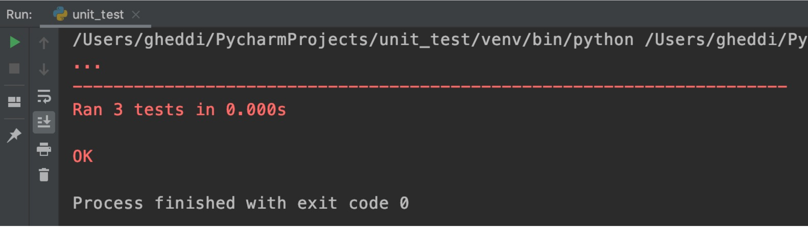
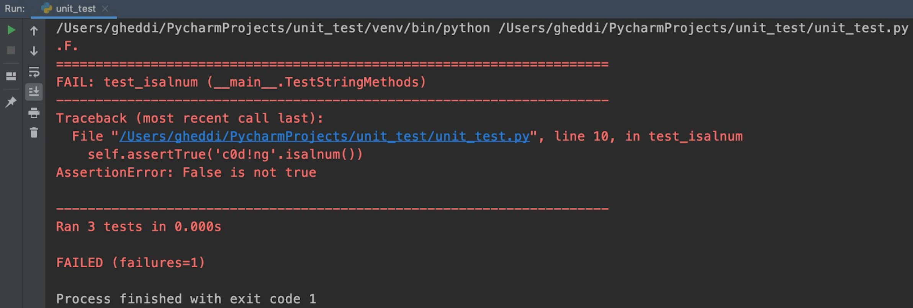
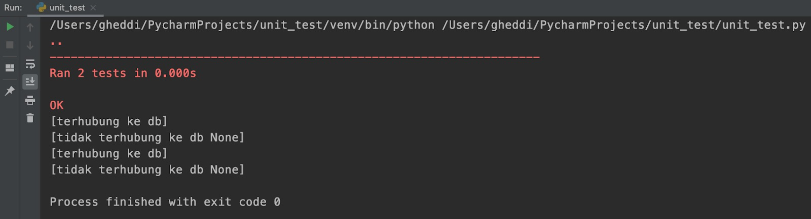

# Unit Testing

Ketika aplikasi yang kita kembangkan nantinya semakin kompleks, akan muncul dependensi yaitu satu atau lebih fungsi digunakan oleh fungsi lain. Atau bahkan ketika kita mulai membangun aplikasi dengan rekan kita, kita membuat fungsi yang digunakan oleh rekan kita, ataupun sebaliknya.

Pada saat membuat fungsi baru ataupun mengubah fungsi yang sudah ada, tentunya perlu dipastikan bahwa fungsionalitas aplikasi yang sebelumnya tidak terganggu dengan adanya perubahan baru tersebut. Bagaimana jika fungsionalitas bukan hanya 5 atau 10, tapi lebih dari itu? Tentu menyulitkan sekali untuk mengeceknya satu per satu setiap kita melakukan perubahan.

Di sinilah kita butuh pengujian (test) untuk fungsi-fungsi tersebut yang dapat dilakukan secara otomatis. 

Kita dapat melakukan ini dengan salah satu library bawaan Python yaitu **unittest**, yang penamaannya sesuai  dengan tugas yang dilakukannya. Unittest merupakan proses pengujian perangkat lunak yang memastikan setiap unit/fungsi dari program teruji. Jika fungsionalitas dari aplikasi yang kita bangun terdiri dari prosedur-prosedur dan fungsi-fungsi yang kita tulis, maka kita perlu melakukan unit test untuk setiap prosedur atau fungsi yang ada.

Sebagai sebuah framework pengujian, unittest mendukung beberapa hal esensial sebagai berikut:

* Pengujian secara otomatis
* Kode awal proses (setup) dan akhir proses (shutdown) yang dapat digunakan ulang
* Penyatuan sejumlah pengujian dalam sebuah koleksi
* Terpisahnya framework pengujian dari framework pelaporan (reporting)

Library unittest mendukung sejumlah konsep penting yang berorientasi objek, antara lain:

* Test fixture merepresentasikan persiapan yang dibutuhkan untuk melakukan satu pengujian atau lebih, serta proses pembersihannya (cleanup). Beberapa contohnya antara lain: menyiapkan basis data pengujian, direktori pengujian, atau mengaktifkan sebuah proses server.
* Test case adalah sebuah unit dari pengujian, di mana ia mengecek sejumlah respons dari sebagian kelompok masukan. unittest menyediakan basis class, TestCase, yang akan digunakan untuk membuat kasus pengujian baru.
* Test suite adalah sebuah koleksi dari kasus-kasus pengujian, koleksi dari test suite itu sendiri, atau gabungan keduanya. Hal ini berguna untuk mengumpulkan pengujian-pengujian yang akan dieksekusi bersama.
* Test runner adalah komponen yang akan mengatur (orchestrates) eksekusi dari pengujian-pengujian dan menyediakan keluaran untuk pengguna. Dalam hal ini runner dapat menggunakan tampilan grafis, tampilan tekstual, atau mengembalikan nilai spesial yang menyatakan hasil dari pengujian.

## Contoh Unit Test di Python

Tulis kode ini pada IDE PyCharm atau simpan kode ini dalam format .py dan jalankan pada Command Prompt di perangkat Anda.

~~~
import unittest
 
class TestStringMethods(unittest.TestCase):
    
    def test_strip(self):
        self.assertEqual('www.dicoding.com'.strip('c.mow'), 'dicoding')
    
    def test_isalnum(self):
        self.assertTrue('c0d1ng'.isalnum())
        self.assertFalse('c0d!ng'.isalnum())
    
    def test_index(self):
        s = 'dicoding'
        self.assertEqual(s.index('coding'), 2)
        # cek s.index gagal ketika tidak ditemukan
        with self.assertRaises(ValueError):
            s.index('decode')
    
if __name__ == '__main__':
    unittest.main()
~~~

Jalankan program di atas. Hasil keluarannya seperti berikut.

Mari kita bahas satu per satu dari kode di atas.

* Kelas TestStringMethods merupakan sebuah kelas yang merupakan turunan (subclass) dari class unittest.TestCase, sehingga proses test dapat dilangsungkan tanpa banyak implementasi lain.
* Ada 3 metode pada class tersebut yang semua namanya diawali dengan kata test, hal ini merupakan konvensi (aturan) yang wajib diikuti untuk menginformasikan ke test runner bahwa sejumlah metode tersebut merepresentasikan test yang akan dioperasikan.
* Pada setiap metode, pengujian dilakukan dengan pemanggilan assert. Pada metode test_strip dilakukan pengecekan kesamaan menggunakan assertEqual untuk memastikan bahwa 'www.dicoding.com'.strip('c.mow') sama dengan ‘dicoding’.
* Pada metode test_isalnum dilakukan pengecekan apakah fungsi bernilai benar (True), dengan assertTrue untuk memastikan bahwa 'c0d1ng'.isalnum() bernilai benar di mana ‘cOd1ng’ adalah betul bertipe alfanumerik . Kemudian juga ada pengecekan apakah fungsi bernilai salah (False) dengan assertFalse untuk memastikan bahwa 'c0d!ng'.isalnum() betul bernilai salah karena ada karakter yang bukan alfanumerik yaitu ‘!’.
* Pada metode test_index dilakukan pengecekan kesamaan seperti sebelumnya dengan menggunakan assertEqual bahwa pencarian substring coding menempati index sama dengan 2. Kemudian juga ada pengecekan apakah akan membangkitkan ValueError dengan menggunakan assertRaises(ValueError), jika pencarian index tidak berhasil ditemukan pada string yang sudah ditentukan.
* Pada bagian terakhir kode ada pemanggilan unittest.main() untuk mulai menjalankan test.

Selanjutnya kita akan membahas hasil keluarannya. Tampak pada keluaran bahwa ada 3 tanda titik (...) yang menyatakan bahwa ketiga fungsi yang dites berhasil melewati test. Dirangkum juga waktu pemrosesan dari total 3 test tersebut berlangsung sangat cepat selama 0.00 detik. serta di baris paling akhir adalah rangkuman bahwa semua test berlangsung sukses (OK).

Anda bisa mencoba melihat keluaran lain dengan membuat gagal salah satu test. Misalnya pada metode test_isalnum keduanya akan diubah menggunakan assertTrue sehingga salah satu fungsi akan gagal. Kodenya bisa Anda lihat di bawah.

~~~
def test_isalnum(self):
        self.assertTrue('c0d1ng'.isalnum())  # ini akan berhasil
        self.assertTrue('c0d!ng'.isalnum())  # ini akan gagal
~~~

Kemudian jalankan kembali program Anda. Keluarannya akan seperti berikut:

Berikut penjelasannya:

* Seperti yang sudah Anda duga bahwa, akan ada pengujian yang gagal, sehingga tertulis .F. yang menggambarkan bahwa pengujian metode kedua gagal (FAIL).
* Berikutnya dijelaskan bahwa kegagalan ada di metode test_isalnum, yaitu sebuah metode dari class __main__.TestStringMethods.
* Lebih jauh, diinformasikan bahwa test_isalnum yang gagal berada pada baris ke 10 pada kode Anda, yakni pada pengecekan self.assertTrue('c0d!ng'.isalnum()) yang memang tadi kita ubah dari assertFalse. Sistem pengujian juga melaporkan bahwa pembandingannya tidak sesuai yakni False tidak bernilai benar seperti yang diharapkan dengan adanya pengujian assertTrue.
* Rekap totalnya ada 3 tests yang dilakukan dalam 0.01 detik. Kemudian secara umum test menghasilkan 1 buah kegagalan (failure).

Cukup mudah dimengerti bukan? Kita dapat melihat sendiri bahwa pengujian hasilnya gagal. Tapi kali ini gagalnya memang sesuai dengan harapan kita.

Sekarang kita coba pengujian dengan contoh yang lebih nyata, misalnya kita memiliki class User di mana kita akan menguji aktif atau tidaknya user dengan melihat apakah dia terkoneksi ke basis data (DB) atau tidak.

Untuk menyederhanakan kodenya dan lebih fokus pada pengujiannya, tulis simulasinya dalam 1 file kode sebagai berikut:

~~~
import unittest
 
def koneksi_ke_db():
    print('[terhubung ke db]')
def putus_koneksi_db(db):
    print('[tidak terhubung ke db {}]'.format(db))
 
class User:
    username = ''
    aktif = False
    def __init__(self, db, username):  # using db sample
        self.username = username
    def set_aktif(self):
        self.aktif = True
 
class TestUser(unittest.TestCase):
    def test_user_default_not_active(self):
        db = koneksi_ke_db()
        dicoding = User(db, 'dicoding')
        self.assertFalse(dicoding.aktif)  # tidak aktif secara default
        putus_koneksi_db(db)
 
    def test_user_is_active(self):
        db = koneksi_ke_db()
        dicoding = User(db, 'dicoding')
        dicoding.set_aktif()  # aktifkan user baru
        self.assertTrue(dicoding.aktif)
        putus_koneksi_db(db)
 
if __name__ == '__main__':
    unittest.main()
~~~

Sama seperti sebelumnya, kita akan membuat sebuah class TestUser yang merupakan turunan dari class unittest.TestCase, kemudian menulis 2 metode untuk pengujian kali ini.

Karena setiap test itu dioperasikan secara terpisah, akhirnya kita menjalankan fungsi koneksi ke basis data dan membuat User dicoding setiap kali proses test. Hal tersebut bukan praktik yang baik karena memakan lebih banyak memori apalagi jika program yang kita uji berukuran besar. Lalu apa praktik yang lebih baik?

Kita akan menggunakan metode bawaan dari class TestCase, yakni metode setUp() dan tearDown().

* Metode setUp() akan dipanggil untuk menyiapkan test sehingga pemanggilannya akan dilakukan setiap sebelum metode test dilaksanakan.
* Metode tearDown() akan dipanggil setiap setelah metode test selesai dilaksanakan, meskipun terjadi kesalahan (exception) pada proses test.

Kode sebelumnya akan kita ubah dengan implementasi kedua metode setUp() dan tearDown(). Kita cukup melakukan perubahan pada class TestUser saja seperti di bawah.

~~~
class TestUser(unittest.TestCase):
    def setUp(self):
        self.db = koneksi_ke_db()
        self.dicoding = User(self.db, 'dicoding')
 
    def tearDown(self):
        putus_koneksi_db(self.db)
    
    def test_user_default_not_active(self):
        self.assertFalse(self.dicoding.aktif)  # tidak aktif secara default
 
    def test_user_is_active(self):
        self.dicoding.set_aktif()  # aktifkan user baru
        self.assertTrue(self.dicoding.aktif)
~~~

Kemudian jalankan kembali program Anda. Hasil keluarannya seperti berikut.

Terlihat bahwa setiap kali melakukan pengujian, metode setUp() dipanggil. Begitu juga setelah selesai pengujian, metode tearDown() dipanggil.

Dengan kemampuan pengujian ini, aplikasi yang Anda buat jadi lebih lebih teruji atau orang biasa bilang dengan istilah lebih tahan banting (robust).